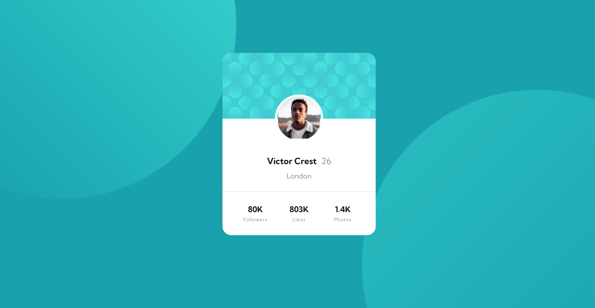

# Frontend Mentor - Profile card component solution

This is a solution to the [Profile card component challenge on Frontend Mentor](https://www.frontendmentor.io/challenges/profile-card-component-cfArpWshJ). 

## Table of contents

- [Overview](#overview)
  - [The challenge](#the-challenge)
  - [Screenshot](#screenshot)
  - [Links](#links)
  - [Built with](#built-with)
  - [What I learned](#what-i-learned)
  - [Continued development](#continued-development)
  - [Useful resources](#useful-resources)
- [Author](#author)
- [Acknowledgments](#acknowledgments)


## Overview
- Profile card component challenge from Frontend Mentor.

### The challenge

- The challenge is to build out the profile card component and get it looking as close to the design (provided) as possible.

### Screenshot

- Here is the screenshots of the profile card component that I have created, just follow the link below.


.png)


### Links

- Solution URL: [Add solution URL here](https://your-solution-url.com)
- Live Site URL: [Add live site URL here](https://your-live-site-url.com)


### Built with

- Semantic HTML5 markup
- CSS custom properties
- Flexbox
- CSS Grid


### What I learned

In this project I learned how to make different well-structured containers class in HTML, and In CSS I learned how we use its different properties like animation, tranformation, opacity, padding, margin, border etc.

Code snippets, see below:

```html
<body>
  <section class="main">
    <div class="circles">
      
      
    </div>
  </section>
</body>
```

```css
.circles .cir1,
.circles .cir2{
    position: absolute;
    width: 800px;
    animation: 2s circles forwards;
    opacity: 0;
    
}

.circles .cir1{
    top: -300px;
    left: -175px;
    transform: translate(-100px, -50px);
}

.circles .cir2{
    bottom: -300px;
    right: -175px;
    transform: translate(100px, 50px);
}

@keyframes circles {
    0%{
        opacity: 0;
    }

    100%{
        opacity: 1;
        transform: translate(0);
    }
}
```

### Continued development

I want to continue focusing on my path to a full stack web developer, i already completed HTML/CSS and JavaScript functionalities and now i'm focusing on remaining onces(React.js, Node.js, Dapps, APIs and Database).


### Useful resources

- [freecodecamp](https://www.freecodecamp.org) - This helped me in using css properties like flex, animation etc. I really liked this platform and will use it going forward.

## Author

- Website - [Harsh Raghuwanshi](https://harsha094.github.io/personal-website/)
- Frontend Mentor - [@harsha94](https://www.frontendmentor.io/profile/harsha094)
- Twitter - [@HarshRa19107484](https://www.twitter.com/HarshRa19107484)


## Acknowledgments

I am very thankfull of [Coding Sections](https://www.youtube.com/channel/UC8YimkS0Yw487d2kr9PEcsg) for helping me in this project.
and also thankfull of [Dr. Angela Yu](https://t.co/uVi2CifJBs) for intoducing me about the Frontend Mentor.

